# Homework 4 — Per-route diagrams (blueprint for uuBml Draw)

For each route, create **one diagram** in uuBml Draw: **Page → main components → `api.*` calls → REST**.

---

## `/` — Home

```mermaid
flowchart LR
  P[app/page.js] --> L[Link cards]
  L -.->|navigate| M[/machines]
  L -.->|navigate| B[/bookings]
```

Static content only (no `fetch` on this page).

---

## `/machines` — Machine list

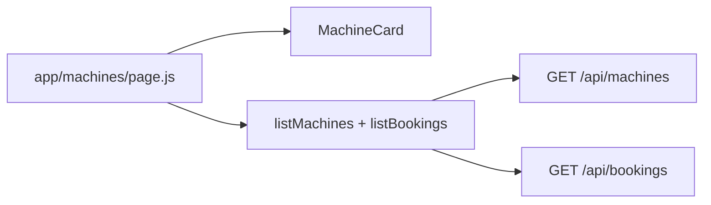

---

## `/machines/new` — Create machine

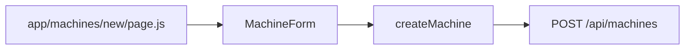

---

## `/machines/[machineId]` — Machine detail + delete

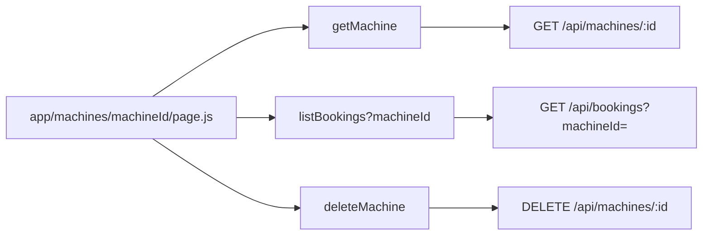

---

## `/machines/[machineId]/edit` — Update machine

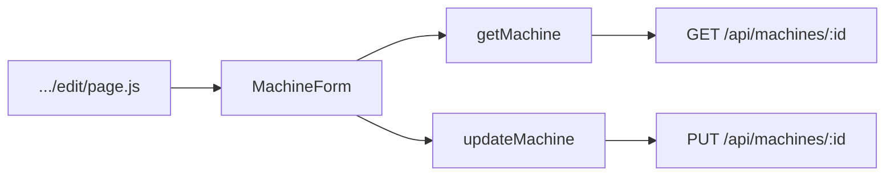

---

## `/machines/[machineId]/schedule` — Read schedule for one machine

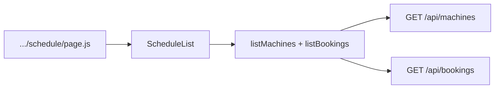

---

## `/bookings` — Booking list

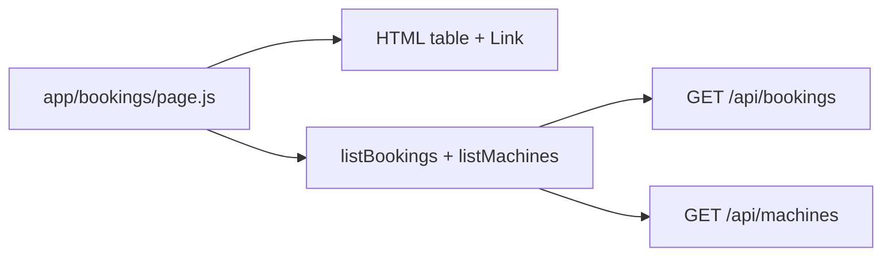

---

## `/bookings/new` — Create booking

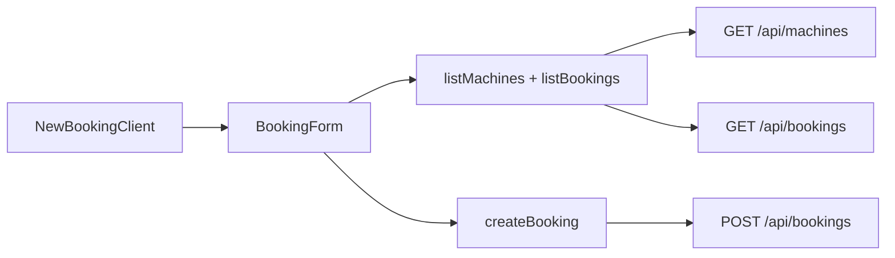

---

## `/bookings/[bookingId]` — Booking detail + delete + cancel panel

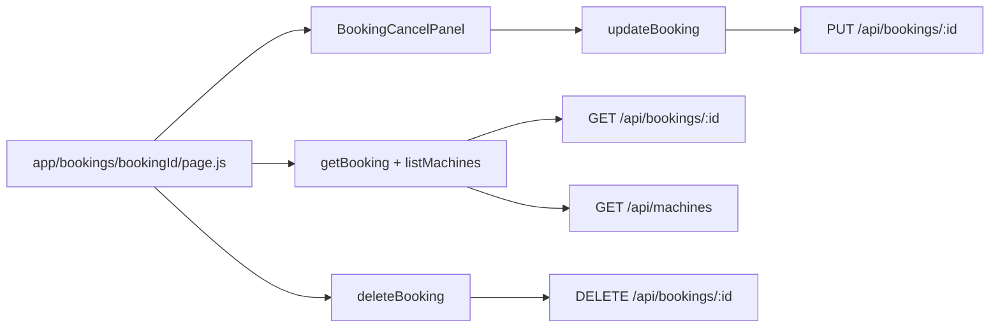

---

## `/bookings/[bookingId]/edit` — Update booking

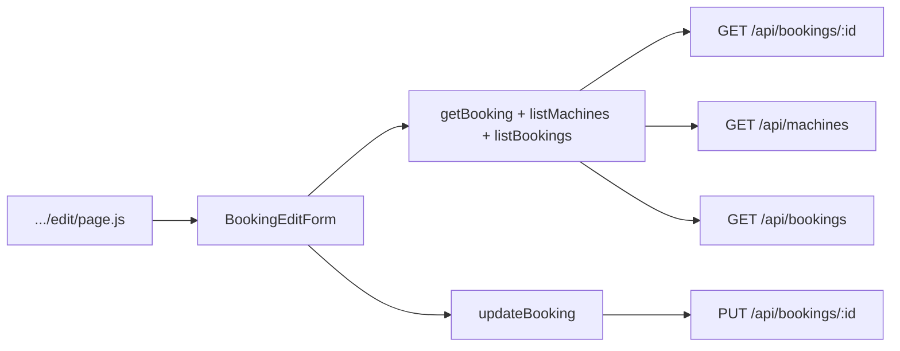

---

## `/bookings/schedule` — Schedule selector

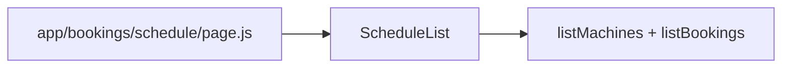

---

## `/bookings/manage` — Cancel with verification

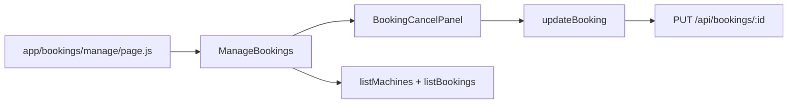

---

These Mermaid blocks are intentionally small so you can redraw them quickly in uuBml Draw while keeping the same structure.
