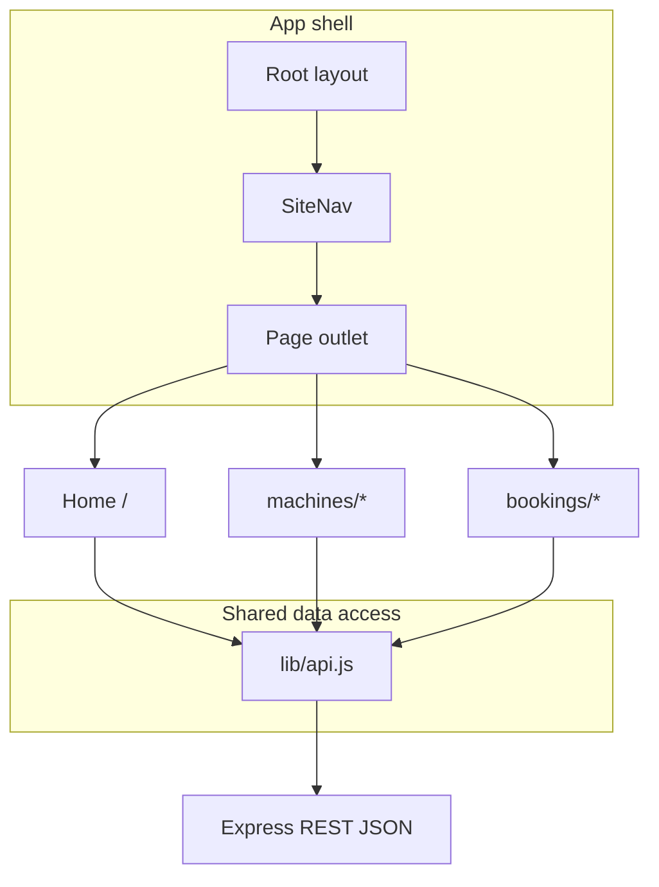
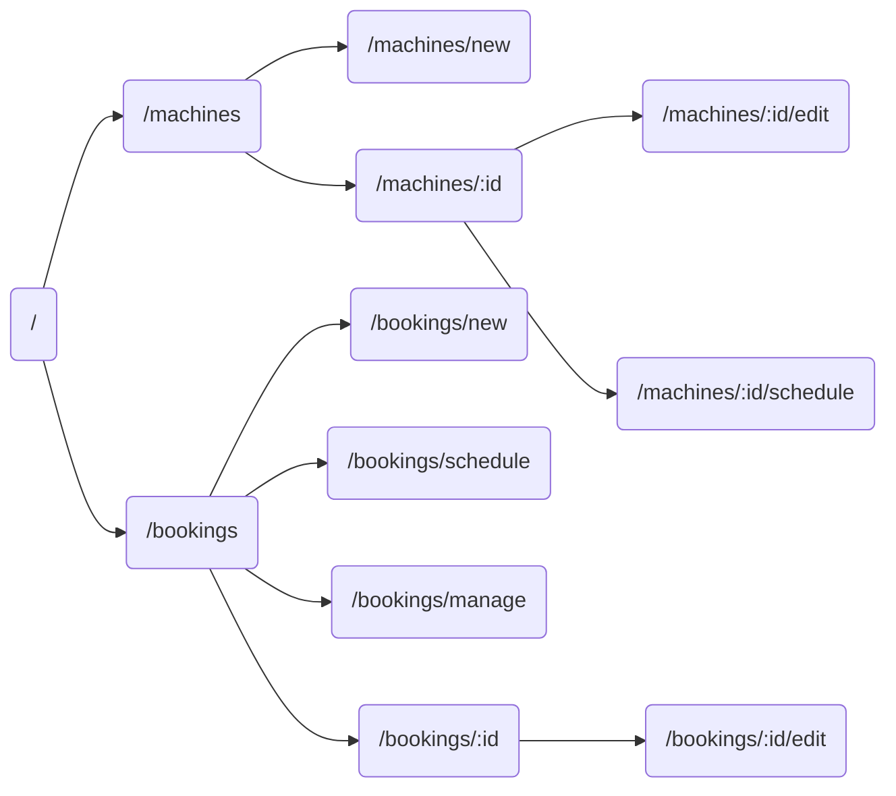

# Homework 4 — SPA diagram (blueprint for uuBml Draw)

Use this section as the **single SPA overview** to redraw in **uuBml Draw**.

## Narrative

The app is a **multi-route React SPA** (Next.js App Router). A shared shell (`AppShell` + `SiteNav`) wraps every page. Each route loads data with `fetch` through `lib/api.js` and renders forms or lists. Navigation uses **client-side** transitions (`next/link`). There is **no authentication** gate.

## Mermaid — high-level SPA structure

## Mermaid — routes as nodes (for a second uuBml sheet if required)

## uuBml Draw tips

- Use one **swimlane** for “Browser UI (React)” and one for “REST API (Express)”.  
- Draw **directed arrows** only where `lib/api.js` calls an endpoint (see per-route file).  
- Label arrows with HTTP method + path, e.g. `GET /api/machines`.
