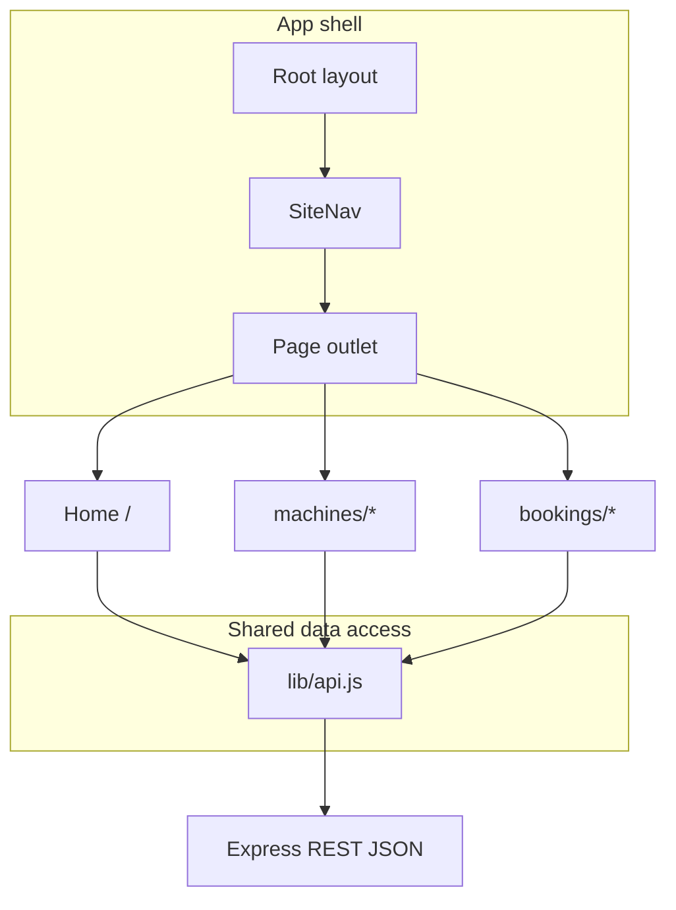
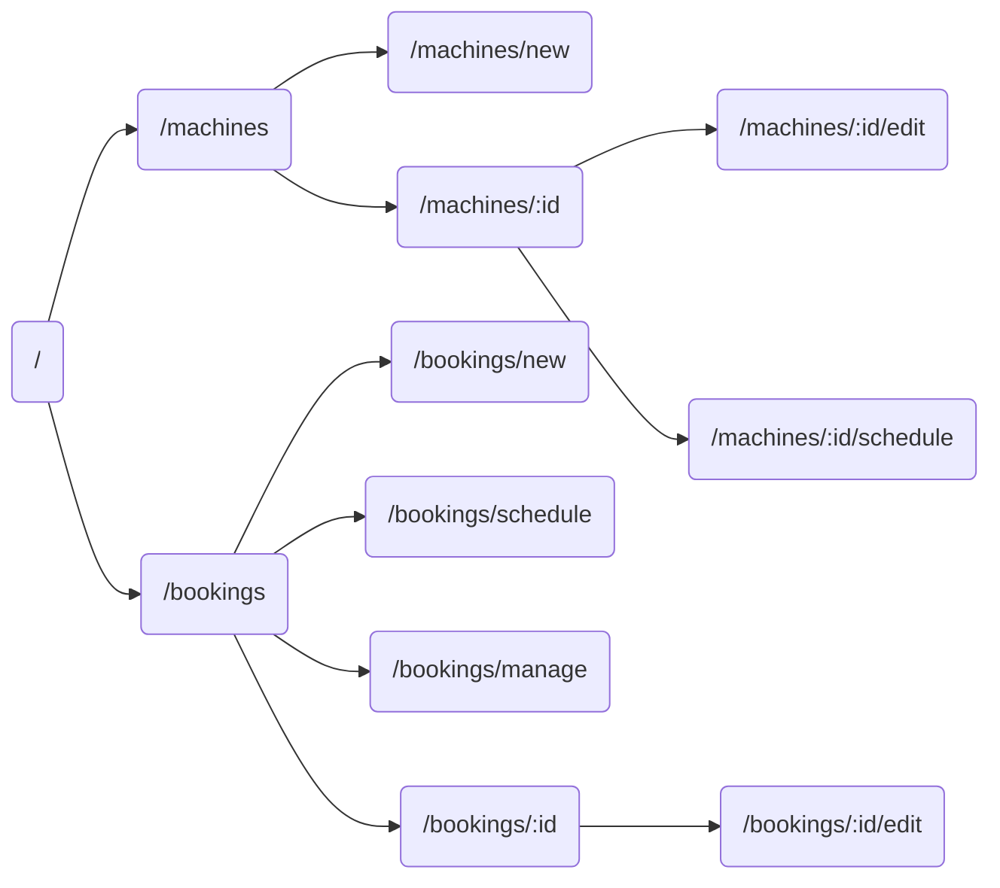

# SPA structure (frontend)

Multi-route React application (Next.js App Router). Shared shell: `AppShell` + `SiteNav` in the root layout. Data access is centralized in `frontend/lib/api.js` (HTTP `fetch` to the Express API). Navigation uses `next/link`.

## High-level architecture

## Route graph

## Diagram conventions

- UI lane: React pages and components under `frontend/app/` and `frontend/components/`.  
- API lane: Express routes under `GET` / `POST` / `PUT` / `DELETE` as in `docs/API_ENDPOINTS.md`.  
- Per-route Mermaid flows: `docs/ROUTE_DIAGRAMS.md`.
